# 🎯 Pytorch Experiment Dashboard
머신러닝 프로젝트가 끝난 뒤, 코드 파일의 내용이 잘 기억나지 않아 정리에 어려움을 겪진 않으셨나요?
<br><br>이 프로그램은 <u>Pytorch 기반 머신러닝 코드 파일</u>을 자동 분석하여 **모델 구조**, **훈련 설정**, **파라미터 통계**, **결과 시각화** 등을 시각적으로 제공하는 도구입니다. 다양한 실험 코드를 보다 쉽게 비교하고, 모델 구조를 빠르게 이해할 수 있도록 돕기 위해 개발되었습니다.

<br>

## 📌 핵심 기능 요약
Pytorch Experiment Dashboard는 다음과 같은 분석 기능을 제공합니다:

* 🔍 Code Parsing: 학습 코드(.py)에서 모델 구조, 학습 설정, 파라미터 정보를 자동 추출
* 🎨 Model Visualization: 파싱된 모델을 graphviz 기반 구조도로 시각화
* 📊 Training Summary: optimizer, epoch, batch_size 등 주요 설정을 자동 인식
* ➗ Parameter Counting: AST 기반 파싱 + sandbox worker를 통한 파라미터 계산
* 📈 Result Visualization: JSON 학습 로그를 자동 시각화 (loss / classification / regression 구분)
* 🗂️ Project-based Comparison: 실험 파일들을 프로젝트 단위로 정리하고 비교

<br>
<p style="text-align: center;">
  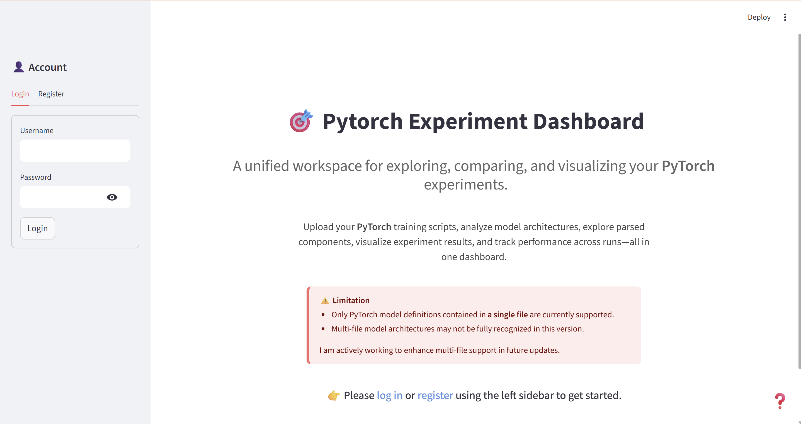
</p>
<br>
<p style="text-align: center;">
  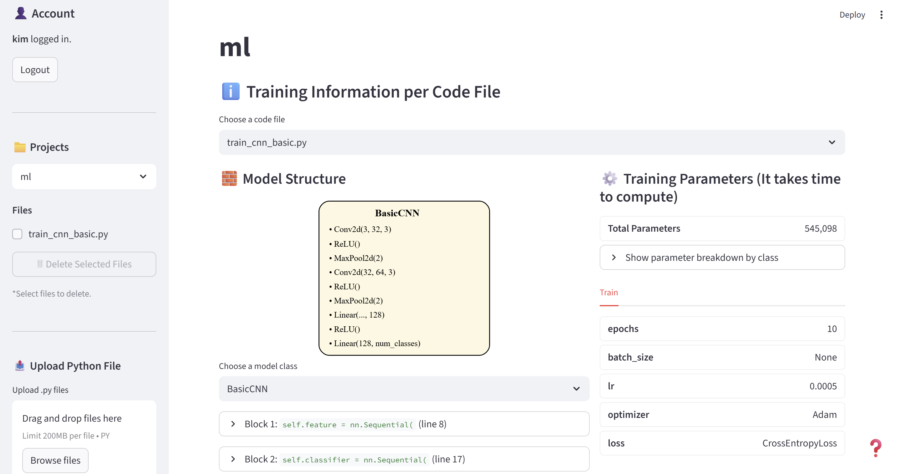
</p>


[Demo Video]("https://youtu.be/lYL9gcHs83A")

## 📄이용 가이드
사용자는 다음 흐름에 따라 대시보드를 이용할 수 있습니다.
### ① 로그인 & 프로젝트 선택
1. 로그인 또는 회원가입을 통해 계정을 생성합니다.
2. 사이드바에서 기존 프로젝트를 선택하거나 새로운 프로젝트를 생성합니다.
3. 새 프로젝트 생성 시, 즉시 해당 프로젝트 페이지로 이동합니다.

### ② 학습 코드 업로드
- 프로젝트가 선택된 상태에서 `.py` 학습 코드를 업로드합니다.
- 업로드된 파일은 자동으로 분석되며, 상단의 파일 선택 메뉴에서 분석 대상을 지정할 수 있습니다.
- 동일 파일 재업로드 시 다음 중 하나를 선택합니다:
  1) 덮어쓰기
  2) 내용이 다르면 새 버전(v1, v2…)으로 저장
  3) 업로드 취소

### ③ 코드 분석 결과 확인
업로드가 완료되면 다음 분석 패널이 표시됩니다:
- **Training Information**: 모델 구조(그래프 포함), 파라미터 수, 학습 설정  
- **Result Visualization**: JSON 로그 기반 학습 그래프  
- **Final Performance**: 파일별 test 성능 요약 표  

각 패널은 업로드된 파일 목록과 연동되며, 여러 파일 간 비교가 가능합니다.

### ④ 결과 파일(JSON) 업로드
- 코드 파일과 동일한 접두사(prefix)를 가진 JSON 로그 파일을 업로드합니다.
- loss / classification / regression 항목을 자동 구분해 시각화합니다.
- 그래프에 마우스를 올리면 시점별 세부 수치를 확인할 수 있습니다.

### ⑤ 프로젝트 관리
- **파일 삭제**: 사이드바에서 삭제 가능하며, 매칭된 JSON 파일도 함께 삭제됩니다.
- **프로젝트 삭제**: 해당 프로젝트의 모든 파일이 삭제됩니다.
- **계정 삭제**: 사용자 데이터 전체 삭제가 가능합니다.

<br>

## 🛠️ 세부 기능 설명
아래는 이 프로젝트가 제공하는 기능을 기술적으로 정리한 목록입니다.

### 1. 사용자 계정 및 데이터 관리
- 로그인/회원가입 
- SQLite 기반 사용자·프로젝트·파일 저장  
- 업로드/삭제 시 DB와 자동 동기화  
- 새로고침에도 페이지 상태 유지  

### 2. 프로젝트 및 파일 관리
| 프로젝트 선택 | 새 프로젝트 생성 |
|--------|---------|
| 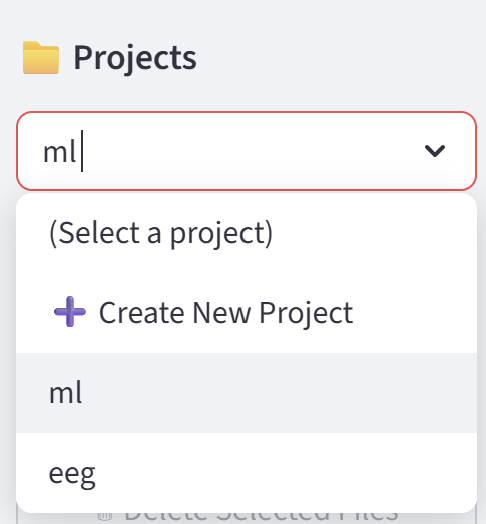 | 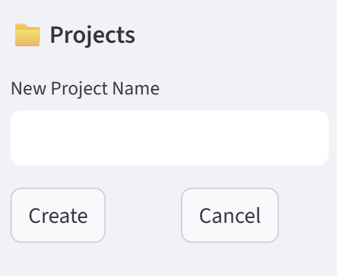 |

- 프로젝트 생성/선택/삭제 
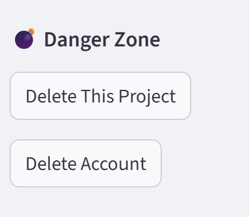
- 파일 업로드, 중복 처리(덮어쓰기/버전 생성/취소) 
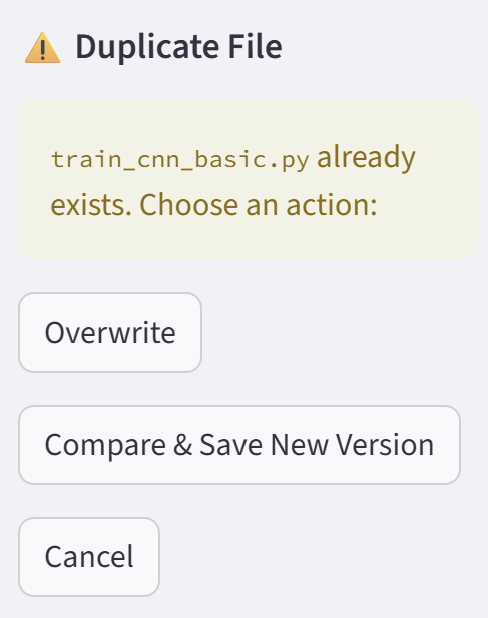
- 업로드 진행 상태를 시각적으로 표시  
- 파일 삭제 시 매칭된 결과 파일(JSON)도 함께 삭제  

### 3. Training Information - 코드 및 모델 분석
#### **모델 구조 분석**  
- AST 기반 model_parser 적용  
- 필요 시 LLM(Gemini) 보조 활용  
- Graphviz 기반 모델 구조 노드 시각화 
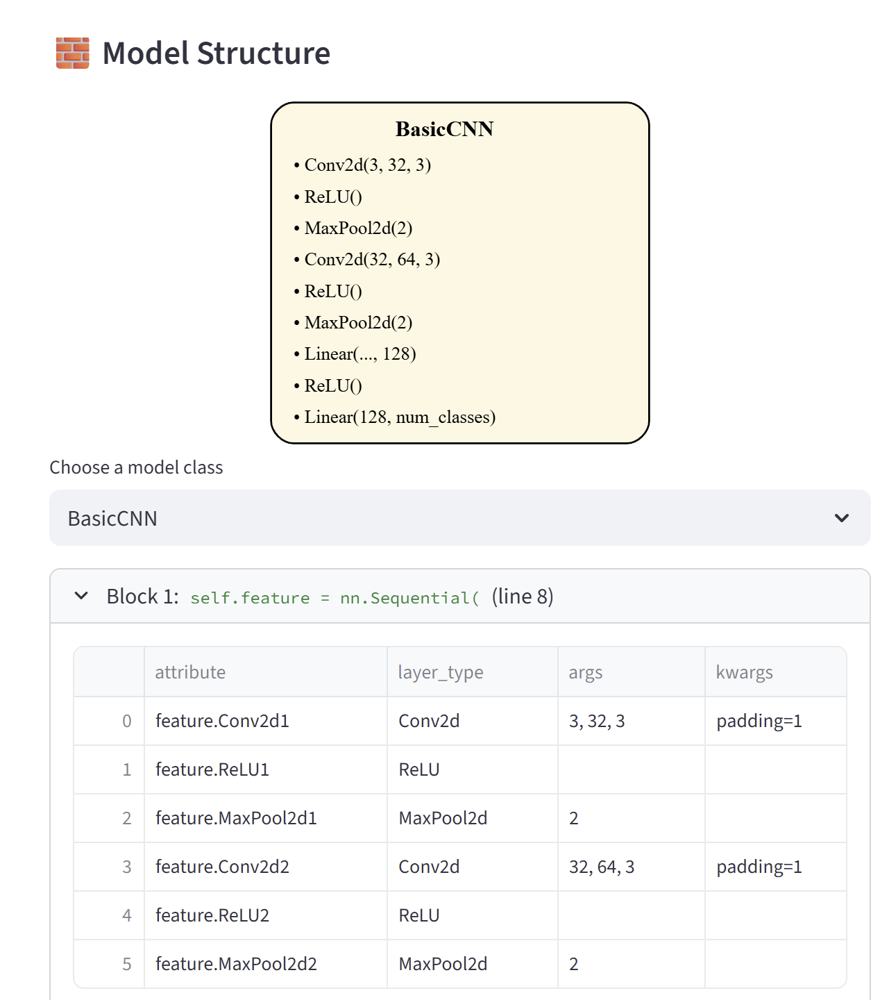
- PyTorch 모델 구조를 한 화면에서 파악 가능  

#### **파라미터 수 계산**  
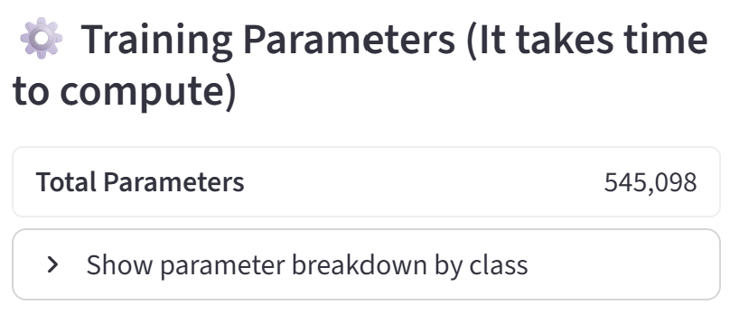
- sandbox worker(param_worker)로 격리된 계산 환경  
- mock_torch 기반 안전한 모델 로딩  
- 계산 불가 시 토글로 표시

- LLM을 통한 추가 계산 시도 가능

#### **하이퍼파라미터 추출**  
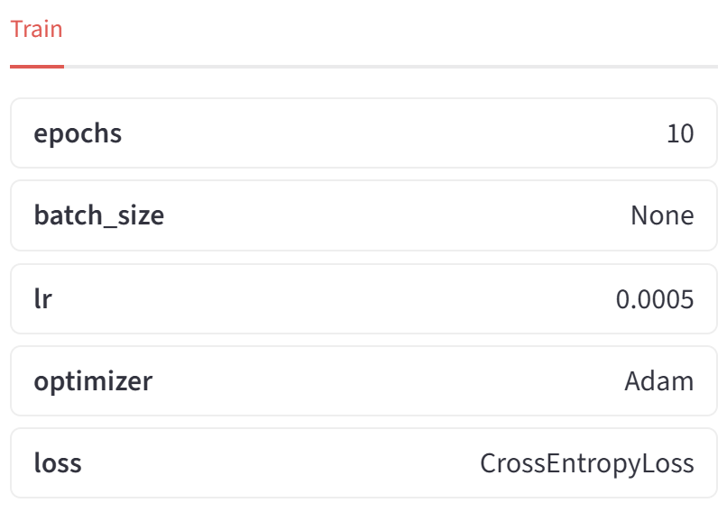
- epoch, batch_size, optimizer 등 자동 인식  
- pretrain / train / finetune 구조 자동 분류 

#### **캐싱**  
- 구조/파라미터/요약 정보 캐싱  
- 동일 파일 재로드 시 즉시 불러오기  

### 4. Result Visualization
#### **JSON 로그 파싱**  
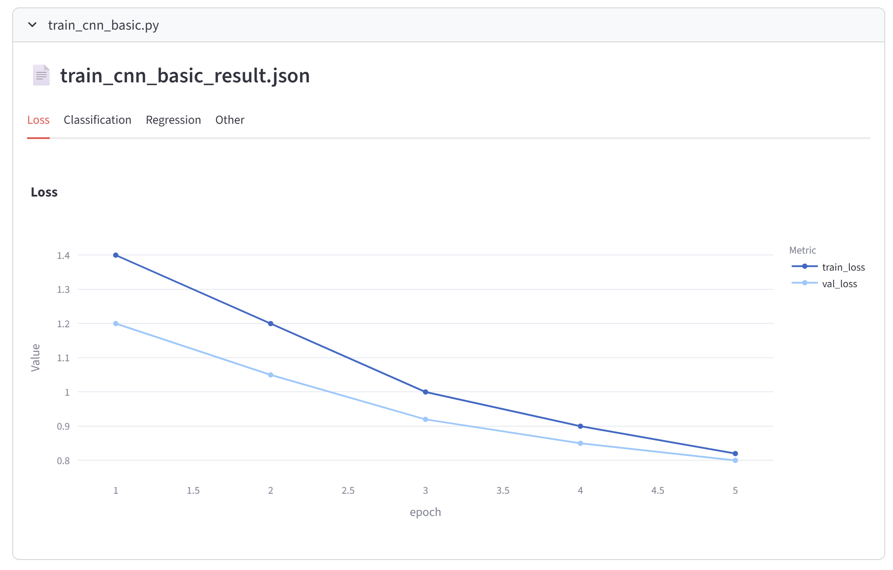
- loss / classification / regression 자동 분류  
- train/val 그래프 분리  
- 여러 파일을 토글 방식으로 비교 가능

#### **인터랙티브 그래프**  
- 마우스 오버(hover) 시 세부 수치 표시  
- 다양한 실험 결과를 직관적으로 비교 가능  

### 5. Final Performance
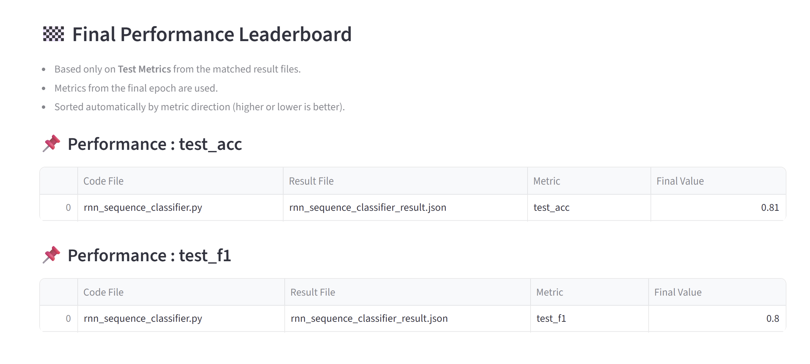
- JSON 로그에서 test 성능만 추출  
- 성능 높은 순으로 정렬  
- 프로젝트 단위 실험 종합 요약  

### 6. 기타 기능
| 업로드 파일 없을 때 | 도움말 |
|--------|---------|
| 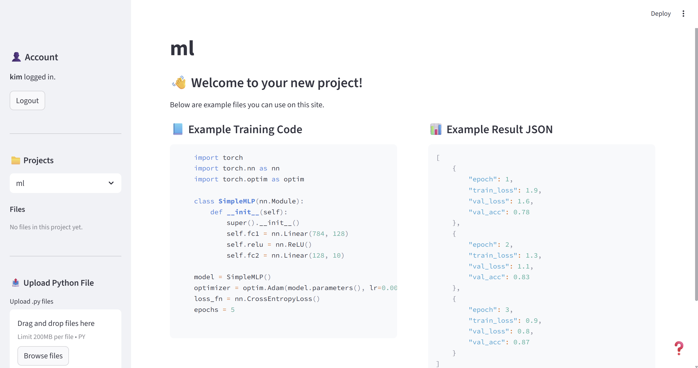 |  |

- 프로젝트에 파일이 없을 때 샘플 학습 코드/결과 파일 제공  
- 화면 하단 ? 아이콘에서 사이트 이용 방법 간단 안내  

<br>

## 🌐 사이트 접속 방법


## 🚀 로컬 실행 방법

### 1) 저장소 클론

```bash
git clone https://github.com/goatyeon03/ML_Code_Insight.git
cd ML_Code_Insight
```
### 2) 백엔드 실행 (FastAPI)

```bash
cd backend
pip install -r requirements.txt
uvicorn main:app --reload
```
FastAPI 문서 접속:
```
http://127.0.0.1:8000/docs
```

### 3) 프론트엔드 실행 (Streamlit)

```bash
cd frontend
pip install -r requirements.txt
streamlit run app.py
```
Streamlit UI:
```
http://localhost:8501
```

## 📁 프로젝트 구조

```
Pytorch_Experiment_Dashboard/
│
├── backend/
│   ├── api.py                   # FastAPI 엔트리포인트
│   ├── requirements.txt         # 백엔드 패키지 목록
│   │
│   ├── llm/                     # LLM 기반 보조 분석 모듈
│   │   ├── gemini.py            # Gemini API 래퍼
│   │   ├── model_name_extractor.py
│   │   ├── param_estimator.py
│   │   └── refine_summary.py
│   │
│   ├── parsers/                 # AST 기반 코드 분석기
│   │   ├── code_parser.py       # 학습 설정 / 하이퍼파라미터 파서
│   │   ├── model_parser.py      # 모델 구조 파서
│   │   ├── module_collector.py  # 모델 구성 요소 수집기
│   │   ├── param_counter.py     # AST 기반 파라미터 계산기
│   │   └── param_worker.py      # 샌드박스에서 안전 실행하는 워커
│   │
│   ├── routes/                  # FastAPI 라우트(엔드포인트) 모음
│   │   └── ...                  # 예: upload, delete, query 등
│   │
│   ├── uploads/                 # 업로드된 파일 저장
│   └── __init__.py
│
├── frontend/
│   ├── app.py                   # Streamlit 메인 앱
│   ├── requirements.txt         # 프론트엔드 패키지 목록
│   │
│   ├── modules/
│   │   ├── diff_utils.py        # 코드 diff 분석
│   │   ├── manage_account.py
│   │   ├── manage_files.py      # 파일 관리 기능
│   │   ├── model_blocks.py      # 모델 구조 블록 시각화
│   │   └── project_dashboard.py # 프로젝트 메인 대시보드
│   │
│   ├── utils/
│   │   ├── auth.py              # 인증 관련 유틸
│   │   ├── db.py                # SQLite 데이터베이스 접근
│   │   ├── file_ops.py          # 파일 처리 유틸
│   │   └── match_utils.py       # 파일 매칭 로직
│   │
│   └── __init__.py
│
└── README.md

```


## 🛣️ 향후 개발 로드맵

- [ ] 다중 코드 파일 고려  
- [ ] 파라미터 수 계산 기능 강화
- [ ] 결과 파일 자동 매치 기능 강화


## 📜 라이선스

라이선스


## 👤 작성자

**Yang Soyeon (양소연)**  
* GitHub: https://github.com/goatyeon03
* E-mail: uaua1595@seoultech.ac.kr